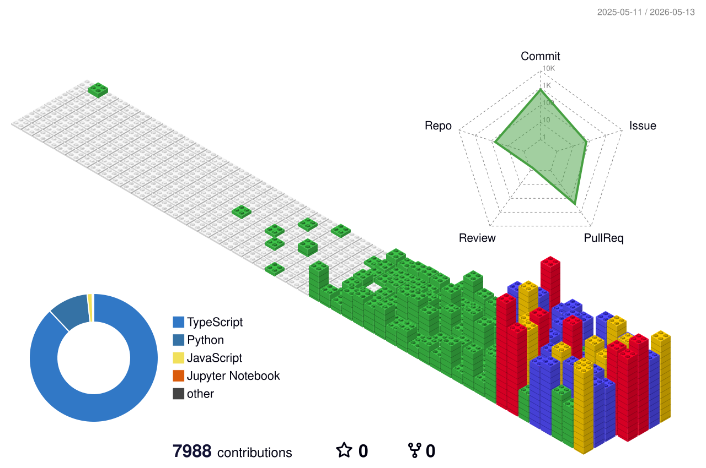

# ClarusIubar

문제를 구조화하고, 구현 가능한 단위로 쪼개고, 끝까지 닫는 쪽을 선호합니다.

## GitHub 3D Contribution Graph

## GitHub Metrics

## Notes

- 3D 그래프는 GitHub contribution 데이터를 매일 렌더링합니다.
- Metrics 카드는 별도 SVG로 분리해 렌더링 실패 지점을 나눴습니다.
- private contribution까지 반영하려면 GitHub 프로필 설정에서
  `Include private contributions on my profile`를 켜야 합니다.
