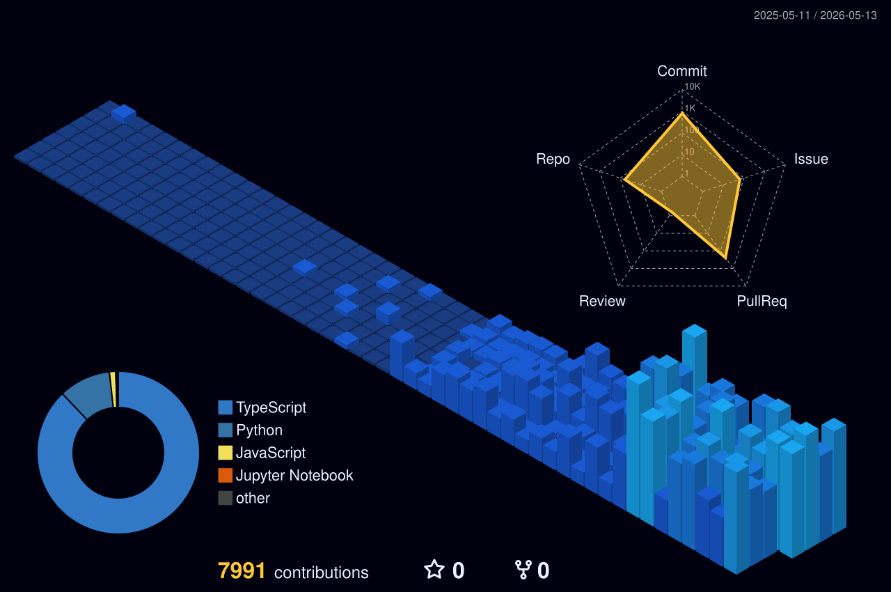

# ClarusIubar

`ClarusIubar` 계정은 추상적인 소개보다, 지금 실제로 어떤 레포를 운영하고 어떤 문제를 풀고 있는지를 기록하는 프로필 README입니다.

- 기준 시점: 2026-05-13
- 총 레포: 111
- 직접 운영 레포: 67
- 포크 레포: 44

## 지금 작업 중인 축

- Agent / Knowledge / Library
  - `library`, `seek_my_document`, `agent_bootstrap`, `orchestration`, `obsidian`을 중심으로 가고 있습니다.
  - 개인 코드와 포크 자산에서 재사용 가능한 모듈을 추출하고, 작업 규약과 개인 지식 검색 계층을 같이 정리하는 축입니다.
- Data / Quant / Automation
  - `etf_rebound_discovery`, `autotrade_old`, `autotrade_renew`, `dexter_garden`, `cosine_word`이 여기에 해당합니다.
  - 데이터 수집, 정규화, 상태 전이, 실행 기록, 운영 자동화가 있는 파이프라인을 만들고 있습니다.
- Product / App / Interface
  - `JamIssue`, `i-need-hand`, `dandelion`, `Octopus`, `shootingStar`, `news`이 이 축에 있습니다.
  - 사용자가 보는 화면, 모바일/웹 흐름, API 경계, 배포 경로를 함께 정리하는 제품 축입니다.
- Infra / Runner / Deployment
  - `docker-setup`, `public-infra-setting`, `100-deploy`, `library/runner`에서 별도로 관리하고 있습니다.
  - self-hosted runner, 배포 공통분모, 로컬 운영 도구를 여기서 다룹니다.

## 레포별로 무슨 일을 하는가

- `library`
  - 개인 코드와 포크 자산에서 공용화할 수 있는 모듈을 추출하고, 계약 테스트와 마이그레이션 기록까지 같이 관리합니다.
- `agent_bootstrap`
  - 에이전트가 issue, branch, checklist, active context를 일관되게 따르도록 만드는 로컬 거버넌스 도구를 개발합니다.
- `seek_my_document`
  - 개인 문서, 노트, 지식베이스를 검색하고 agentic retrieval에 연결하는 실험 축입니다.
- `etf_rebound_discovery`
  - 장기 운영을 전제로 한 수집/상태 전이/실행 파이프라인을 만듭니다.
- `JamIssue`
  - 실제 사용자가 쓰는 제품 구조를 다루며, 모바일/웹 구성, API 호환성, 배포 기준을 함께 정리합니다.
- `dandelion` / `Octopus`
  - 특정 문제 영역을 제품화하는 실험 축으로, 감정 기록이나 선택 보조 같은 구체적 사용자 가치를 다룹니다.

## 포크는 무슨 의미인가

- 포크는 내 주력 작업 자체라기보다, 관심사와 참조 구조를 따라가는 레이어로 분리해 보고 있습니다.
- 주로 보는 포크는 `paperclip`, `symphony`, `codex`, `opencode`, `openclaw`, `qmd`, `GitNexus`, `firecrawl`, `memori`, `Agentic-R`, `ReasonRank`, `camel`, `vllm`입니다.
- 여기서는 아이디어를 가져오지만, 실제로 운영하는 코드와 제품 경계는 내 비포크 레포에서 만듭니다.

## 현재 주안점

- 포크를 쌓는 것보다, 직접 운영 레포에서 재사용 가능한 구조를 추출하는 일
- 실험 코드를 관리 가능한 단위로 정리하는 일
- 한 번 실행되는 코드보다 오래 운영 가능한 파이프라인과 작업 규약을 만드는 일
- 제품 레포, 데이터 레포, 연구/참조 레포의 역할을 섞지 않고 분리하는 일

## Contribution Graph

## Languages

  

